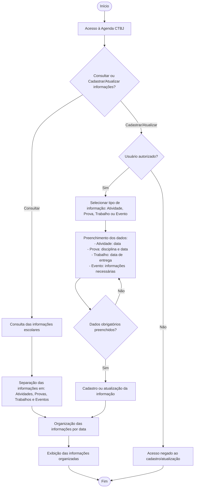

# Documento de Arquitetura e Modelagem — CTBJ Conforto

**Projeto:** Agenda CTBJ

**Versão:** 1.2

**Fase:** Etapa II

**Aluno:** João Victor Marques Arnaldo

---

# Fluxograma Inicial — Agenda CTBJ

Diagrama de fluxo referente ao projeto acadêmico **Agenda CTBJ — Organização Digital da Rotina Escolar**, representando as funcionalidades de consulta, cadastro e atualização de informações escolares (provas, trabalhos, atividades e eventos), conforme os requisitos funcionais (RF01–RF08) e regras de negócio (RN01–RN05) definidos no projeto.

## Legenda

| Elemento | Representação |
|---|---|
| Início / Fim | Círculo (terminal) |
| Ação / Processo | Retângulo |
| Decisão | Losango |
| Fluxo | Seta |

## Referência aos requisitos

- **RF01–RF04**: cadastro de atividades, provas, trabalhos e eventos (nó *Selecionar tipo de informação*).
- **RF05, RF08**: consulta de provas, trabalhos, atividades e eventos (nó *Consulta das informações escolares*).
- **RF06**: organização das informações por data (nó *Organização das informações por data*).
- **RF07**: atualização de informações cadastradas (nó *Cadastro ou atualização da informação*).
- **RN01–RN03**: campos obrigatórios por tipo de cadastro (nó *Preenchimento dos dados*).
- **RN04**: verificação de usuário autorizado (decisão *Usuário autorizado?*).
- **RN05**: organização das atividades por data (nó *Organização das informações por data*).
